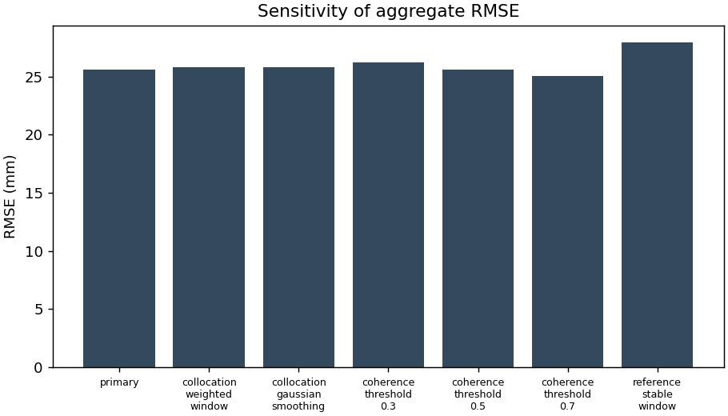
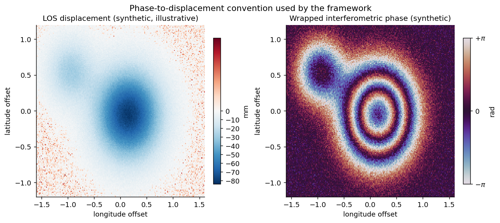
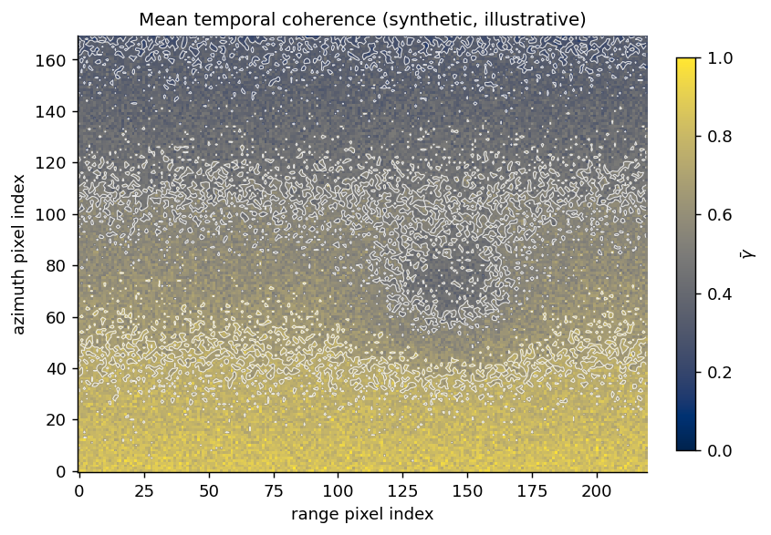
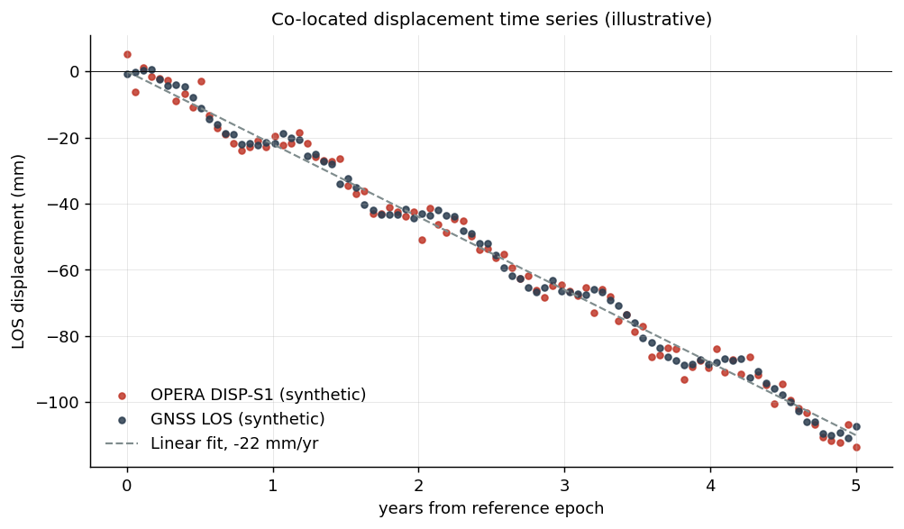
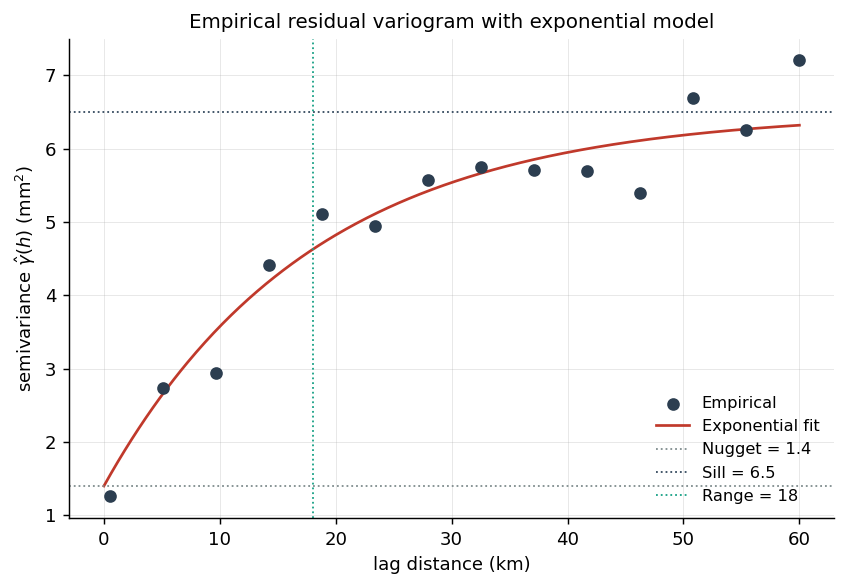
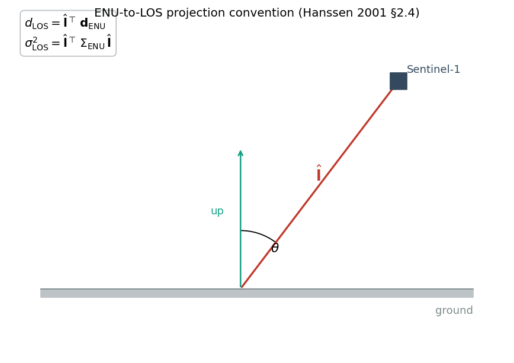
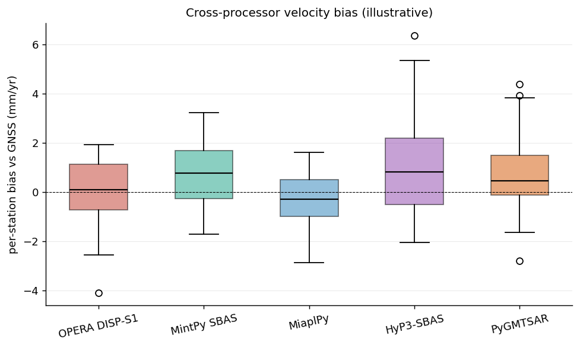

<h1 align="center">DISP-S1 Evaluation Framework</h1>

<p align="center">
  <em>Reproducible validation of the OPERA Sentinel-1 surface-displacement product against continuous GNSS, with a uniform abstraction over MintPy, MiaplPy, HyP3-SBAS, and PyGMTSAR.</em>
</p>

<p align="center">
  <a href="LICENSE"></a>
  
  
  
</p>

<p align="center">
  
  
</p>

---

## Overview

This repository is a research instrument for evaluating Sentinel-1 InSAR
displacement products against independent geodetic ground truth. The
framework treats reference-frame realization, atmospheric correction, and
processor choice as experimental factors, and produces every result as a
versioned artifact with full provenance.

The first completed study evaluates groundwater-related land subsidence in
the San Joaquin Valley, California, using real OPERA DISP-S1 NetCDF
products and continuous GNSS time series. Volcano and landslide
configurations can follow the same protocol under [`configs/`](configs/)
and [`experiments/`](experiments/).

## Highlights

- **Pre-declared validation protocol.** Inclusion criteria, collocation
  rules, statistical tests, and verdicts fixed in
  [`docs/validation-protocol.md`](docs/validation-protocol.md) before any
  experiment is run.
- **Uniform processor abstraction.** One `DeformationProductReader`
  protocol with adapters for OPERA DISP-S1, MintPy, MiaplPy, HyP3-SBAS,
  and PyGMTSAR.
- **Geodetically correct GNSS handling.** ENU projected to per-pixel LOS
  with full covariance propagation, not the up-only approximation.
- **Statistical error decomposition.** Empirical variogram with
  exponential fit, triple collocation, paired bootstrap, reference-point
  bootstrap, and closure-phase residuals.
- **Reproducible experiments.** One CLI command per experiment, with a
  `manifest.json` recording software versions, granule IDs, station
  list, random seeds, runtime, and SHA-256 of every output.

## Current Real-Data Track

**E01: Central Valley OPERA DISP-S1 vs GNSS** is the first measured
experiment. It validates OPERA Level-3 DISP-S1 displacement against
Nevada Geodetic Laboratory daily GNSS positions over the San Joaquin
Valley aquifer system.

The current expanded local run uses OPERA frame `F09155`, 12 DISP-S1
epochs, 21 admitted GNSS stations, and 243 collocated InSAR-GNSS pairs.
For this frame and time window, the DISP-S1 minus GNSS LOS residual has
RMSE 25.58 mm, MAE 21.00 mm, and a bootstrap bias interval of -3.30 to
3.01 mm after station-wise reference alignment. The result is documented
as a frame-specific validation result, not a regional verdict for all
Central Valley frames.

| Result | Value |
| --- | ---: |
| OPERA frame | `F09155` |
| OPERA epochs | 12 |
| GNSS stations | 21 |
| Collocated pairs | 243 |
| RMSE | 25.58 mm |
| MAE | 21.00 mm |
| RMSE 95% CI | 23.63 to 27.53 mm |
| Bias 95% CI | -3.30 to 3.01 mm |

<table>
  <tr>
    <td align="center">
      <br/>
      <sub>Measured DISP-S1 LOS displacement, final epoch</sub>
    </td>
    <td align="center">
      <br/>
      <sub>Measured OPERA temporal coherence</sub>
    </td>
  </tr>
  <tr>
    <td align="center">
      <br/>
      <sub>GNSS station residual RMSE map</sub>
    </td>
    <td align="center">
      <br/>
      <sub>Validation sensitivity across methodological choices</sub>
    </td>
  </tr>
</table>

The wet-run pipeline supports local OPERA NetCDF granules and local or
cached NGL `tenv3` files. A completed run writes:

```text
experiments/E01_central_valley_disp_s1_vs_gnss/results/
  per_station.csv
  aggregate.json
  station_timeseries/*.csv
  figures/*.png
  sensitivity.json
  analysis.md
  manifest.json
  summary.md
```

Large OPERA products are not committed. Measured CSV/JSON/PNG artifacts
are small enough to commit after a real run, with the input granule IDs
and checksums captured in `manifest.json`.

## Real-Data Pipeline

The framework consumes Sentinel-1 displacement products and continuous-GNSS
daily positions, projects both into a common line-of-sight reference,
applies the named collocation strategy, and reports per-station and
aggregate statistics together with sensitivity diagnostics.

```bash
python -m experiments.E01_central_valley_disp_s1_vs_gnss.run \
    --config experiments/E01_central_valley_disp_s1_vs_gnss/config.yml \
    --output experiments/E01_central_valley_disp_s1_vs_gnss/results \
    --download-only \
    --limit-granules 12
```

```bash
python -m experiments.E01_central_valley_disp_s1_vs_gnss.run \
    --config experiments/E01_central_valley_disp_s1_vs_gnss/config.yml \
    --output experiments/E01_central_valley_disp_s1_vs_gnss/results
```

## Method Illustrations

The measured E01 figures above are the current study outputs. The figures
below document additional method concepts and expected artifact types for
future experiments.

<table>
  <tr>
    <td align="center">
      <br/>
      <sub>LOS displacement and wrapped interferometric phase (illustrative)</sub>
    </td>
    <td align="center">
      <br/>
      <sub>Mean temporal coherence used by the coherence mask</sub>
    </td>
  </tr>
  <tr>
    <td align="center">
      <br/>
      <sub>Co-located InSAR and GNSS LOS time series</sub>
    </td>
    <td align="center">
      <br/>
      <sub>Empirical residual variogram with exponential fit</sub>
    </td>
  </tr>
  <tr>
    <td align="center">
      <br/>
      <sub>ENU-to-LOS projection convention</sub>
    </td>
    <td align="center">
      <br/>
      <sub>Cross-processor velocity bias (illustrative)</sub>
    </td>
  </tr>
</table>

## Installation

```bash
git clone https://github.com/roymustang11/InSAR.git
cd InSAR
python -m venv .venv
source .venv/bin/activate
python -m pip install --upgrade pip
python -m pip install -e ".[dev]"
pytest
```

For real-data experiments (HDF5, NetCDF, Zarr, NGL downloads):

```bash
python -m pip install -e ".[dev,io,notebooks]"
```

OPERA products require an Earthdata Login. Credentials are read from
`.netrc`, environment variables, or an interactive `earthaccess` flow.

## Usage

### Validate an experiment configuration

```bash
python -m experiments.E01_central_valley_disp_s1_vs_gnss.run \
    --config experiments/E01_central_valley_disp_s1_vs_gnss/config.yml \
    --output experiments/E01_central_valley_disp_s1_vs_gnss/results \
    --dry-run
```

The dry-run validates the configuration, emits a `manifest.json`, and
exits without performing I/O. It is the same orchestration path used by
the wet run.

### Library example

```python
from disp_s1_eval.processors import OperaDispS1Reader, available_readers
from disp_s1_eval.gnss import parse_tenv3, project_enu_to_los
from disp_s1_eval.errors import triple_collocation, empirical_variogram
from disp_s1_eval.metrics import rmse, velocity_difference

print(available_readers())
# ['hyp3_sbas', 'mintpy', 'miaplpy', 'opera_disp_s1', 'pygmtsar']
```

A full self-contained tour is in
[`notebooks/06_framework_overview.ipynb`](notebooks/06_framework_overview.ipynb).

## Repository layout

```text
configs/                   Study-area configurations (YAML).
data/                      Local data conventions; large products are not committed.
docs/                      Methodology, validation protocol, data provenance, figures.
experiments/               Numbered, self-contained experiments.
notebooks/                 Method-definition and overview notebooks.
src/disp_s1_eval/          Library: processors, gnss, errors, metrics, config.
tests/                     Unit and offline integration tests.
```

## Documentation

| Document | Purpose |
| --- | --- |
| [`docs/methodology.md`](docs/methodology.md) | LOS geometry, reference frames, atmospheric correction handling, noise model, bibliography. |
| [`docs/validation-protocol.md`](docs/validation-protocol.md) | Pre-declared per-station and aggregate validation rules. |
| [`docs/data-provenance.md`](docs/data-provenance.md) | Source, version, license, access, and citation for every dataset. |
| [`docs/research-roadmap.md`](docs/research-roadmap.md) | Phased extension to volcano and landslide study areas. |

## Library modules

| Module | Purpose |
| --- | --- |
| `disp_s1_eval.processors` | `DeformationProductReader` protocol and adapters for OPERA DISP-S1, MintPy, MiaplPy, HyP3-SBAS, PyGMTSAR. |
| `disp_s1_eval.gnss` | NGL `tenv3` ingestion, ENU-to-LOS projection with covariance, named temporal collocation strategies. |
| `disp_s1_eval.errors` | Empirical variogram and exponential fit, triple collocation, paired and reference-point bootstrap, closure-phase residuals. |
| `disp_s1_eval.metrics` | Pointwise validation metrics (RMSE, MAE, bias, correlation, σ-coverage, velocity difference). |
| `disp_s1_eval.opera` | OPERA DISP-S1 filename parsing and Kerchunk/Zarr reference inspection. |
| `disp_s1_eval.timeseries` | `DisplacementTimeSeries` container, CSV ingestion, date alignment. |
| `disp_s1_eval.config` | Validated study-area configuration loader. |

## Citation

If you use this framework in academic work, please cite it via
[`CITATION.cff`](CITATION.cff).

## License

[MIT](LICENSE).

## Acknowledgements

This framework integrates open-source software and open data products:
[MintPy](https://github.com/insarlab/MintPy),
[MiaplPy](https://github.com/insarlab/MiaplPy),
[ISCE3](https://github.com/isce-framework/isce3),
[PyGMTSAR](https://github.com/AlexeyPechnikov/pygmtsar),
[HyP3](https://hyp3-docs.asf.alaska.edu/),
[earthaccess](https://earthaccess.readthedocs.io/), and the
[Nevada Geodetic Laboratory](http://geodesy.unr.edu/) GNSS solutions.
See [`AUTHORS.md`](AUTHORS.md) for the contributor list and
[`docs/data-provenance.md`](docs/data-provenance.md) for full citations.
