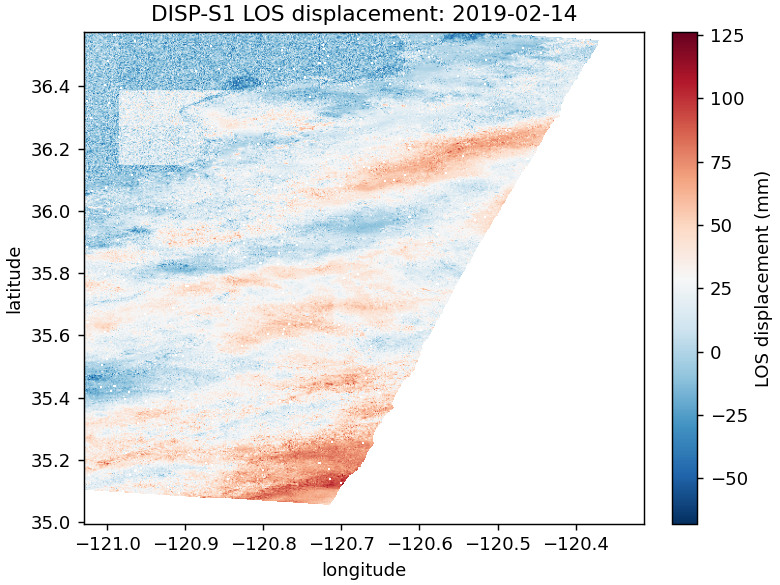
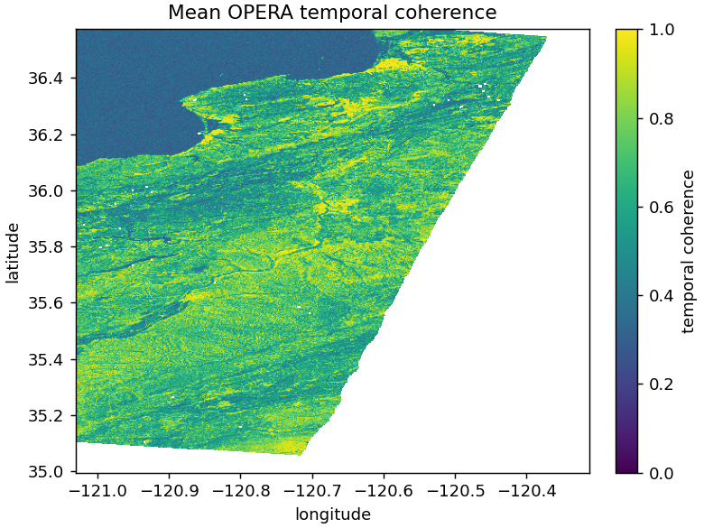
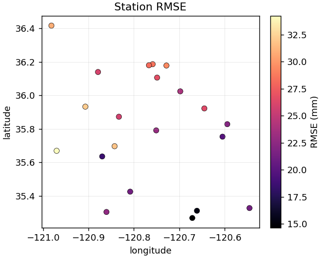
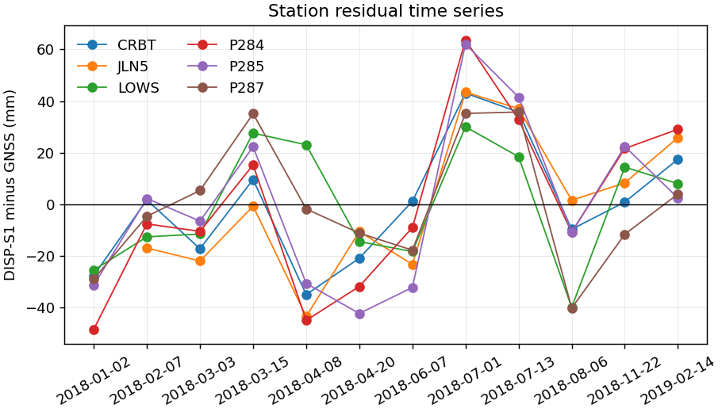

# E01 — OPERA DISP-S1 vs Continuous GNSS over the San Joaquin Valley

## Result Snapshot

This experiment is the repository's first completed real-data validation
study. It evaluates OPERA DISP-S1 frame `F09155` against NGL continuous
GNSS over the San Joaquin Valley.

| Result | Value |
| --- | ---: |
| OPERA epochs | 12 |
| Admitted GNSS stations | 21 |
| Collocated InSAR-GNSS pairs | 243 |
| RMSE | 25.58 mm |
| MAE | 21.00 mm |
| RMSE 95% CI | 23.63 to 27.53 mm |
| Bias 95% CI | -3.30 to 3.01 mm |

<table>
  <tr>
    <td align="center">
      <br/>
      <sub>Measured DISP-S1 LOS displacement</sub>
    </td>
    <td align="center">
      <br/>
      <sub>Measured OPERA temporal coherence</sub>
    </td>
  </tr>
  <tr>
    <td align="center">
      <br/>
      <sub>Station residual RMSE</sub>
    </td>
    <td align="center">
      <br/>
      <sub>Residual time series across representative stations</sub>
    </td>
  </tr>
</table>

The result is an expanded frame-specific validation, not a regional verdict
for every Central Valley OPERA frame. The main conclusion is that the
workflow is reproducible and scientifically diagnostic: it finds near-zero
aggregate bias after station-wise alignment, but residual magnitudes remain
around 20-30 mm for this frame and time window.

## Question

How reliable is OPERA Level-3 DISP-S1 for measuring groundwater-related
land subsidence in the San Joaquin Valley when independently validated
against continuous-GNSS daily positions?

The experiment evaluates three linked questions:

1. **Accuracy.** What are the station-level and aggregate residuals
   between DISP-S1 LOS displacement and GNSS projected into the same LOS?
2. **Error structure.** Are residuals dominated by random scatter,
   station-specific offsets, temporal-collocation choices, masking choices,
   or spatially correlated error?
3. **Scientific usability.** Under the declared protocol, what conditions
   make DISP-S1 suitable or unsuitable for Central Valley subsidence
   monitoring?

## Hypothesis

H1. After LOS projection, temporal collocation, and station-wise reference
alignment, DISP-S1 residuals against GNSS are unbiased at the aggregate
level and have stable station-level errors across the admitted validation
network.

H0 is the negation: the product shows non-zero aggregate bias, unstable
station-level behavior, or sensitivity to processing choices large enough
to change the interpretation.

The study uses tiered verdicts:

| Tier | Minimum evidence | Purpose |
| --- | --- | --- |
| Pilot | 2 OPERA epochs, at least 5 admitted GNSS stations | Verify the real-data pipeline and provenance. |
| Expanded | At least 8 OPERA epochs, at least 10 admitted GNSS stations | Support quantitative validation and sensitivity analysis. |
| Final | Enough epochs for stable trend estimates at most admitted stations | Support trend-level scientific interpretation. |

## Datasets

- **InSAR.** OPERA DISP-S1 V1 NetCDF granules covering one Sentinel-1
  ascending frame intersecting the AOI declared in `config.yml`.
  Granule identifiers and download URLs are recorded in
  `results/manifest.json` after a run.
- **GNSS.** Final IGS20 daily solutions from the Nevada Geodetic
  Laboratory (`tenv3`) for stations whose footprint lies inside the AOI
  and that meet the protocol inclusion criteria.

Provenance for both is documented in
[`docs/data-provenance.md`](../../docs/data-provenance.md).

## Method

1. Load DISP-S1 granules through
   `disp_s1_eval.processors.OperaDispS1Reader`.
2. For each admitted GNSS station, project ENU (with full covariance)
   into the per-pixel LOS using `disp_s1_eval.gnss.project_enu_*`.
3. Temporally collocate GNSS to InSAR epochs using the strategy declared
   in `config.yml` (default: `nearest`).
4. Reference both series by removing the station-wise mean residual over
   the collocated epochs. Stable-window alignment is evaluated as a
   sensitivity branch when enough early epochs are available.
5. Compute per-station metrics from `disp_s1_eval.metrics`.
6. Compute the empirical residual variogram
   (`disp_s1_eval.errors.empirical_variogram`) and fit an exponential
   model.
7. Run collocation, masking, reference-alignment, and bootstrap
   sensitivity branches.
8. Write `results/per_station.csv`, `results/aggregate.json`,
   `results/figures/`, `results/summary.md`, and
   `results/manifest.json`.

## Output Index

| Artifact | Purpose |
| --- | --- |
| `results/analysis.md` | Scientific interpretation and limitations. |
| `results/final_status.md` | Final local package status, metrics, and verification commands. |
| `results/aggregate.json` | Aggregate metrics, bootstrap intervals, variogram. |
| `results/per_station.csv` | Station-level residual and trend metrics. |
| `results/sensitivity.json` | Collocation, coherence, and reference sensitivity. |
| `results/station_coverage.csv` | Candidate GNSS coverage against valid OPERA pixels. |
| `results/figures/` | Real measured maps, station diagnostics, and sensitivity plots. |
| `results/manifest.json` | Provenance, input hashes, output hashes, config snapshot. |

## Reproducibility

### 1. Build or inspect the OPERA cache

With Earthdata credentials configured:

```bash
python -m experiments.E01_central_valley_disp_s1_vs_gnss.run \
    --config experiments/E01_central_valley_disp_s1_vs_gnss/config.yml \
    --output experiments/E01_central_valley_disp_s1_vs_gnss/results \
    --download-only \
    --limit-granules 12
```

To reuse files already present in `processor.cache_dir`:

```bash
python -m experiments.E01_central_valley_disp_s1_vs_gnss.run \
    --config experiments/E01_central_valley_disp_s1_vs_gnss/config.yml \
    --output experiments/E01_central_valley_disp_s1_vs_gnss/results \
    --download-only \
    --use-existing
```

### 2. Prepare GNSS station metadata

The default config expects a compact station holdings file at:

```text
data/raw/ngl/central_valley_holdings.txt
```

Format:

```text
station latitude longitude start end epochs
P056 36.1234 -120.1234 2018-01-01 2023-12-31 1800
```

Stations are selected automatically from this file using the AOI, time
window, and `gnss.min_epochs` threshold in `config.yml`. Corresponding
`tenv3` files are cached under `gnss.cache_dir`.

### 3. Run the validation

```bash
python -m experiments.E01_central_valley_disp_s1_vs_gnss.run \
    --config experiments/E01_central_valley_disp_s1_vs_gnss/config.yml \
    --output experiments/E01_central_valley_disp_s1_vs_gnss/results \
    --use-existing
```

The run is deterministic given the seed declared in `config.yml`. Wall
clock depends on the number of granules and stations; for a two-year,
single-frame configuration with ~20 stations, the typical time on a
modern laptop is on the order of minutes once data are downloaded.

## Primary Inclusion Rules

An admitted station must satisfy all of the following:

- It lies within the configured AOI and the selected OPERA frame footprint.
- Its local OPERA neighborhood contains valid displacement pixels after
  product mask and coherence screening.
- NGL provides enough IGS20 daily epochs for the experiment time window.
- It has at least two collocated InSAR-GNSS pairs for pilot metrics; trend
  metrics require the expanded or final tier.

Stations failing these checks are written to `results/skipped_stations.csv`
with the reason.

## Deviations

The pilot tier reports displacement residual metrics only. Velocity
thresholds and final aggregate verdicts are reserved for expanded/final
runs with enough temporal samples for trend estimation.
